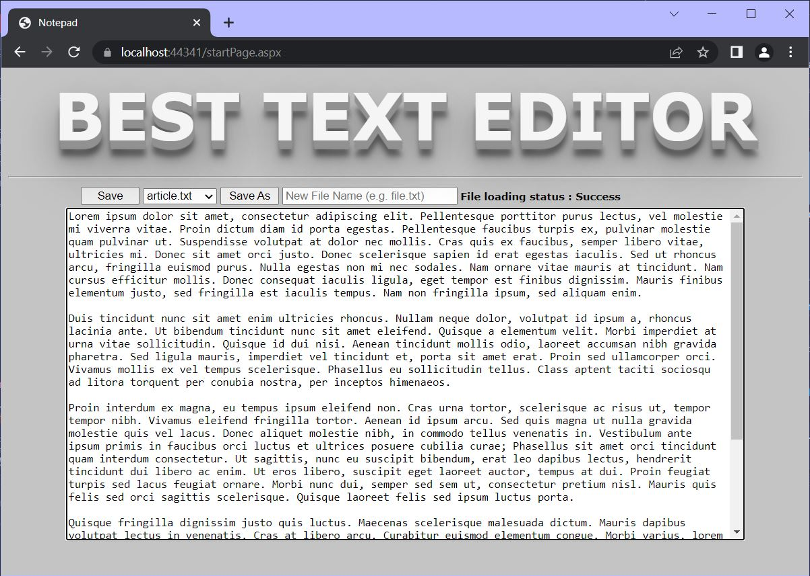
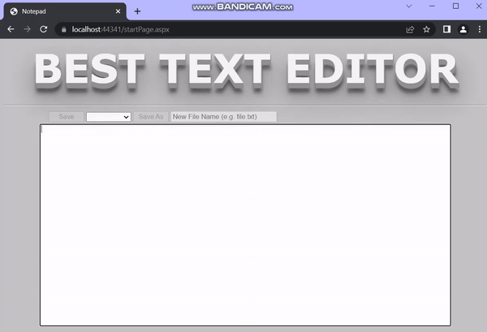
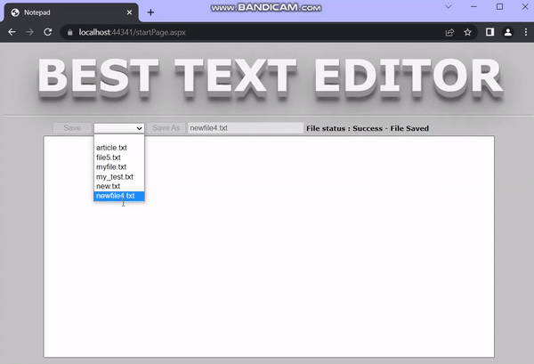
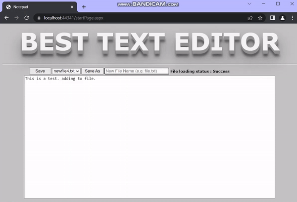
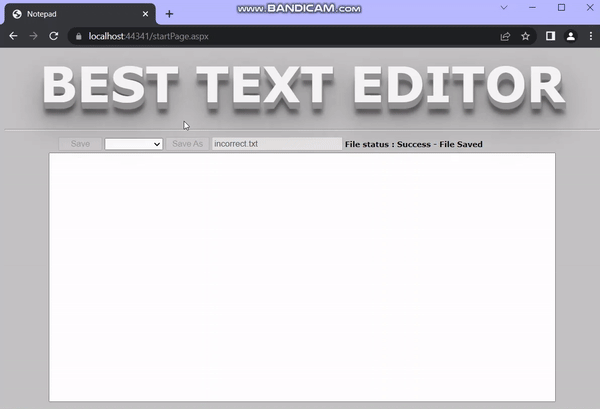

<!-- PROJECT LOGO -->
 

<h3 align="center">ASP.NET jQuery Text Editor</h3>

  

    Text editor built in C# and JavaScript using ASP.NET, JSON, AJAX, and jQuery 
     
     
     
  

<!-- TABLE OF CONTENTS -->

  
Table of Contents

  <ol>
    <li>
      <a href="#about-the-project">About The Project</a>
      <ul>
        <li><a href="#built-with">Built With</a></li>
      </ul>
    </li>
    <li>
      <a href="#getting-started">Getting Started</a>
    </li>
    <li><a href="#usage">Usage</a></li>
    <li><a href="#contact">Contact</a></li>
    <li><a href="#acknowledgments">Acknowledgments</a></li>
  </ol>

<!-- ABOUT THE PROJECT -->
## About The Project

 

This project is a text editor built in ASP.NET using JavaScript (jQuery, AJAX, JSON) and C#. It allows the use of local files by showing a drop down list containing all files within the "MyFiles" folder. The user can then select the file of their choice which will cause its contents of the file to appear in the working area. It supports reading and writing text files. The user may open a text file they already have, modify the contents, and save the file as a new text file or overwrite the original. The user may also create a new file in the program and save it. The program will provide feedback to the user if any errors occur.

(<a href="#readme-top">back to top</a>)

### Built With

* [![ASP dot NET][ASP.NET]][ASP.NET-url]
* [![CSharp][C-sharp]][Csharp-url]
* [![Asynchronous JavaScript and XML][AJAX]][AJAX-url]
* [![jjSON][JSON]][JSON-url]
* [![jjQuery][jQuery]][jQuery-url]
* [![hyper][HTML5]][HTML5-url]
* [![stylesheets][CSS3]][CSS3-url]
* [![java-script][JavaScript]][JavaScript-url]

(<a href="#readme-top">back to top</a>)

<!-- GETTING STARTED -->
## Getting Started

To setup this program all you will need is Visual Studio and support for ASP.NET. 

(<a href="#readme-top">back to top</a>)

<!-- USAGE EXAMPLES -->
## Usage

To use the program, all that is needed is to run the solution. You can open the test file from the drop down list called "article.txt" or begin typing in the work area right away. You can then save the file, overwrite a file, or start a new file.

 

Example of user typing into blank working area, button re-enabling for "save as" as text has been detected, and user saving their project as a new file titled "newfile4.txt". User feedback showing file has been saved appears, and the file list updates dynamically showing the saved file in the drop down list. User can select the file and the contents that were previously saved now appear in the working area. 

 

Example of user opening a text file, adding more text to the file, then saving the file/ overwriting the file with the updated contents, followed by opening the file again to show the contents have been saved successfully. 

 

Example of error checking. User typing incorrect file format (missing extension). The program provides feedback that the file name is missing an exension, while also keeping the working area with the previous text to make sure unsaved progress is not lost. User then types correct file name format and file is saved successfully.

 

Example of user selecting and opening various text files found within the "MyFiles" folder.

(<a href="#readme-top">back to top</a>)

<!-- CONTACT -->
## Contact

Briana Burton - [in/briana-burton/](https://www.linkedin.com/in/briana-burton/) - brianareburton@gmail.com

Project Link: [https://github.com/bburton0334/asp.net_text_editor](https://github.com/bburton0334/asp.net_text_editor)

(<a href="#readme-top">back to top</a>)

<!-- ACKNOWLEDGMENTS -->
## Acknowledgments

* I am not responsible for someone maliciously copying this source code with the intent of submitting it as their own for an assignment.

(<a href="#readme-top">back to top</a>)

<!-- MARKDOWN LINKS & IMAGES -->
[ASP.NET]: https://img.shields.io/badge/asp.net-000000?style=for-the-badge&logo=.net&logoColor=white
[ASP.NET-url]: https://dotnet.microsoft.com/en-us/apps/aspnet
[C-sharp]: https://img.shields.io/badge/C%23-000000?style=for-the-badge&logo=csharp&logoColor=white
[Csharp-url]: https://docs.microsoft.com/en-us/dotnet/csharp/
[JSON]: https://img.shields.io/badge/json-000000?style=for-the-badge&logo=json&logoColor=white
[JSON-url]: https://www.json.org/json-en.html
[jQuery]: https://img.shields.io/badge/jquery-000000?style=for-the-badge&logo=jquery&logoColor=white
[jQuery-url]: https://jquery.com/
[HTML5]: https://img.shields.io/badge/html5-000000?style=for-the-badge&logo=html5&logoColor=white
[HTML5-url]: https://developer.mozilla.org/en-US/docs/Glossary/HTML5
[CSS3]: https://img.shields.io/badge/css3-000000?style=for-the-badge&logo=css3&logoColor=white
[CSS3-url]: https://developer.mozilla.org/en-US/docs/Web/CSS
[AJAX]: https://img.shields.io/badge/ajax-000000?style=for-the-badge&logo=ajax&logoColor=white
[AJAX-url]: https://developer.mozilla.org/en-US/docs/Web/Guide/AJAX
[JavaScript]: https://img.shields.io/badge/JavaScript-000000?style=for-the-badge&logo=javascript&logoColor=white
[JavaScript-url]: https://developer.mozilla.org/en-US/docs/Web/JavaScript
